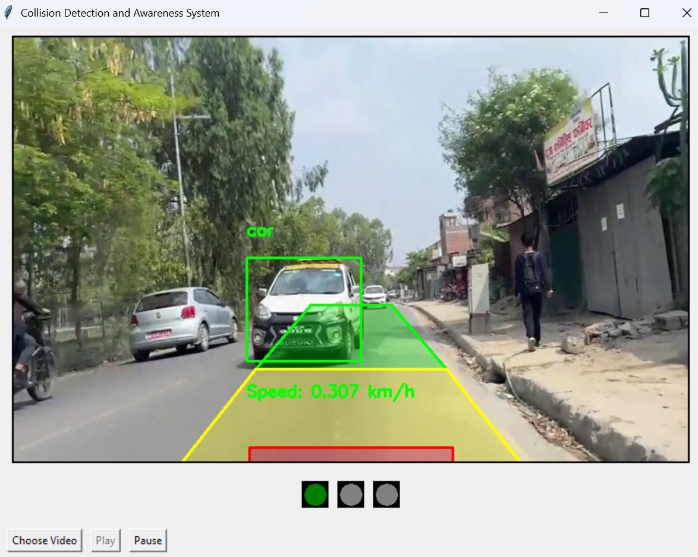
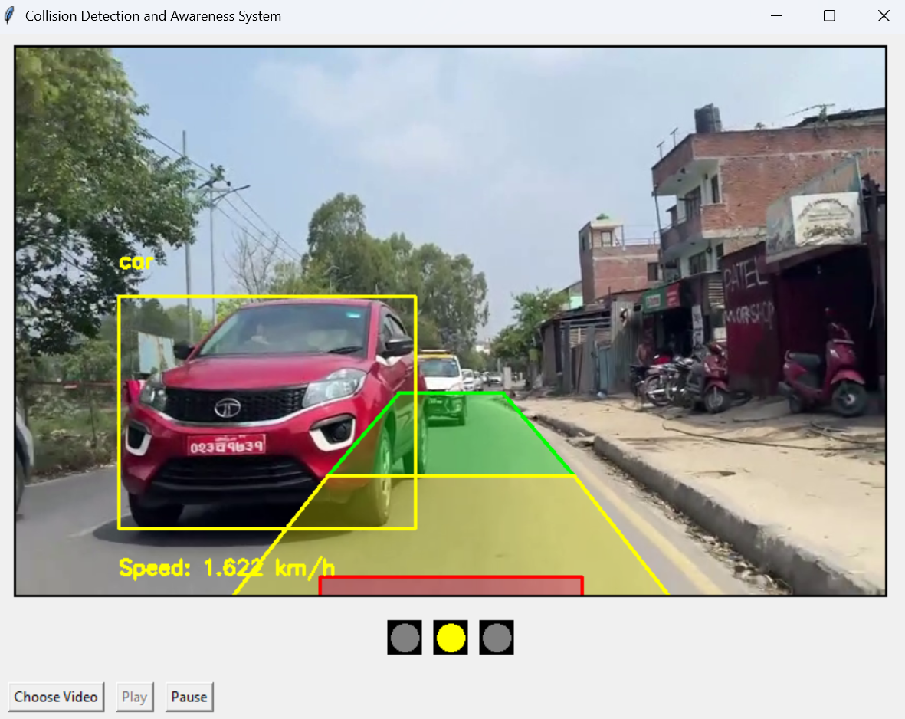

# Collision Detection and Awareness System
An intelligent system for rear vehicle detection, tracking, and speed estimation using YOLOv8, DeepSORT, and homography. It provides visual lane zone classification (green/yellow/red) and real-time audio-visual alerts to help prevent collisions. The GUI is built with Tkinter.

## 🚀 Features

- Detects vehicles (car, truck, motorcycle, bus) using YOLOv8
- Tracks vehicle movement using DeepSORT
- Estimates real-world speed using homography and bounding box tracking
### 🎯 Key Concepts

#### 🚘 Relative Speed Estimation
- The system assumes the **host vehicle is stationary**.
- Each detected vehicle's position (bottom-center of bounding box) is transformed from pixel coordinates to **real-world meters** using **homography mapping**.
- Using the movement of these real-world points across video frames, the **relative speed** of each vehicle is estimated in **km/h**.

#### 🟫 Virtual Lane Zones (Trapezoid Area)
- A **trapezoidal virtual lane** is overlaid on the frame and divided into:
  - 🟢 **Green Zone** (Safe)
  - 🟡 **Yellow Zone** (Caution)
  - 🔴 **Red Zone** (Danger)
- If a vehicle's **bounding box overlaps any zone by more than 5%**, it is considered present in that zone.

#### 🎨 Bounding Box Color Logic
Bounding boxes are drawn based on the vehicle's **zone and speed**:
- 🟢 **Green Zone**:
  - Speed ≤ 10 km/h → Green box( just to show over speeding case if vechile in green zone is overspeeding)
  - Speed > 10 km/h → Yellow box
- 🟡 **Yellow Zone**:
  - Speed ≤ 8 km/h → Yellow box
  - Speed > 8 km/h → Red box
- 🔴 **Red Zone**:
  - Speed ≤ 5 km/h → Yellow box
  - Speed > 5 km/h → Red box

---

### 🚦 Traffic Light Indicator (Tkinter UI)
- The system shows a **traffic light-style indicator** based on the most dangerous detection in the current frame:
  - 🔴 Red → Critical danger detected
  - 🟡 Yellow → Warning
  - 🟢 Green → Safe

---

### 🔊 Audio Alerts
- The system plays looping **audio alerts** depending on the most severe zone:
  - 🔴 **Red Zone** → High alert sound
  - 🟡 **Yellow Zone** → Warning alert sound
  - 🟢 **Green Zone** → No sound
   
- Built-in video player using Tkinter

## 🎥 Demo

### 🟢 Safe Zone

> Vehicles in the green zone with safe speed are shown in green boxes. No alert is triggered.

### 🟡🔴 Alert Zones

> Vehicles overlapping yellow or red zones with higher speed trigger caution (yellow) or danger (red) alerts if it exceeds speed limit.

